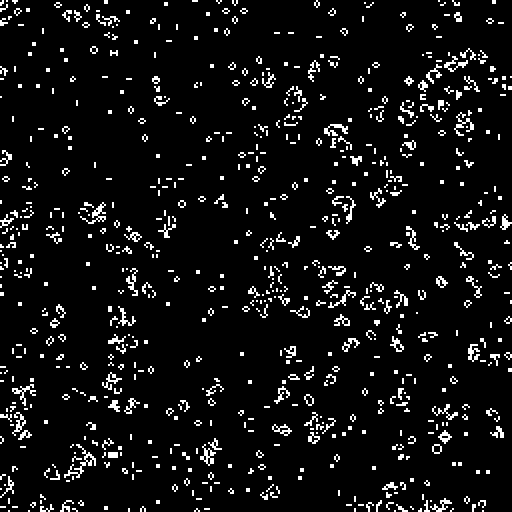
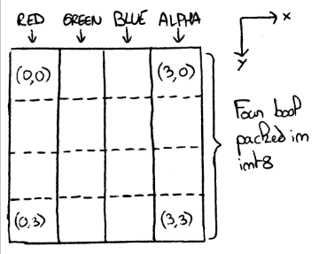
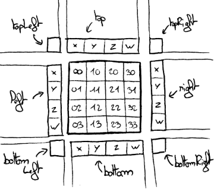

# game-of-life-webgl

## Description
This project is a simple simulation of Conway's Game of Life, running on GPU.

The rules can be changed to see how the world evolves. You can use the mouse to zoom in and explore the world.

See it live [here](https://piellardj.github.io/game-of-life-webgl/?page%3Acanvas%3Afullscreen=true&page%3Acanvas%3Asidepane=true).

## Details

### Texel packing

In order for the GPU to compute the world's evolution, the grid data must be stored in a texture so that it can be accessed from the fragment shader.

A first approach would be to store each cell in a pixel of the texture. However the cell state is binary and it would be a waste to use a whole 32 bits texel to store it.

Unfortunately, compact texture formats are only available in WebGL 2, so I chose to use a RGBA texture and to pack a 4x4 binary grid in it: each 8 bit channel stores the state of 4 vertical cells. The packing/unpacking is handled in the fragment shaders and uses floats since WebGL 1 does not allow integer textures or bitwise operators.

Packing a 4x4 cells grid in each texel allows for faster processing. The texture stored in VRAM is 16 times smaller than the visible grid. Updating a texel still takes 9 texture fetches (8 neighbours + previous version of itself) but it updates 16 grid cells at once, so we only need 0.56 texture fetches per grid cell (instead of 9 for a non-compressed storage). Of course by using more appropriate formats, we could achieve a much better ratio but it was enough for this project.

Packing / unpacking the cells adds a bit more computing complexity to the shaders, however it negligible compared to the texture fetches it avoids. Moreover, I try to unpack as few cells as needed: in order to udpate a texel, I only unpack one mat4, four vec4 and four floats.

### Rules

The update shader is partially rewritten and recompiled every time the rules change. The rules are written using exclusively the step function. The standard Game of Life rules require four step calls to update a cell (and the compiler will mutualize two of them so only three calls are actually used).

### Persistence

Persistence is a visual effect making a dead cell look like it is slowly turning off. It helps see motion (especially gliders).

Since grid data is compressed into the texture, there is no room to store for how long a cell has been dead. So to add persistence to the rendering, I simply avoid clearing the drawing buffer each frame (using the 'preserveDrawingBuffer' option) and I use blending to slowly dim dead cells. Unfortunately because of this technique, when zooming or moving in the world, the canvas must be cleared to avoid artifacts, and the persistence is lost.